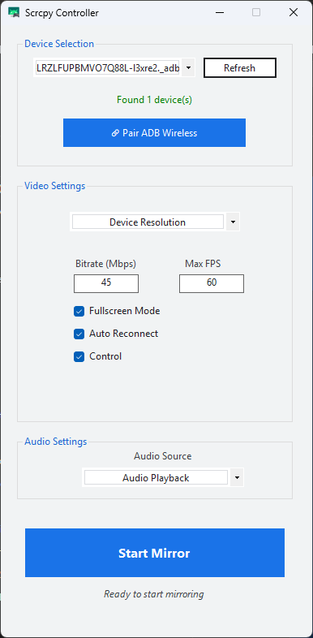
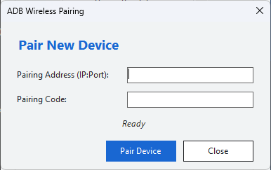

# 🚀 Project ANJEL
### *Advanced SCRCPY Controller for Windows*


**Project ANJEL** is a modern, lightweight Windows-based graphical user interface (GUI) for [scrcpy](https://github.com/Genymobile/scrcpy). It is designed to simplify Android mirroring, recording, and device control directly from your PC without the need for complex terminal commands.

---

## ✨ Key Features

### 📽️ Visual & Mirroring
- **High Performance Mirroring:** Supports high bitrates (up to 100Mbps+) and framerates up to 120 FPS for ultra-smooth motion.
- **Resolution Customization:** Choose the perfect resolution for your monitor (Original, 1080p, 720p, etc.).
- **Fullscreen Mode:** Enjoy your Android screen in full glory with a single click.
- **No-Control Mode:** Use the device in "presentation mode" without mouse/keyboard input interference.

### 🔊 Audio Suite
- **Multiple Audio Sources:** Switch between *Audio Playback* (app sound), *Microphone*, or disable audio completely.
- **Audio Duplication:** Play sound on both your PC and Android device simultaneously.

### 📶 Connectivity & Reconnect
- **Wireless ADB Pairing:** Integrated pairing dialog to connect your device via Wi-Fi without USB cables.
- **Auto-Reconnect:** Smart algorithm that automatically re-establishes connection if the device disconnects.
- **Device Management:** Automatic detection of connected devices and memory of the last used device.

### 🛠️ Stability & Performance
- **Process Manager:** Efficiently handles scrcpy launches and prevents duplicate background processes.
- **Advanced Arguments:** Add your own custom `scrcpy` parameters for maximum flexibility.
- **Resource Optimization:** Built with .NET 8, ensuring a small footprint and low RAM usage.

---

## 📸 User Interface

### Main Dashboard


### ADB Wireless Pairing


> Tip: This app utilizes custom UI components like `NoArrowNumericUpDown` and `Custom Draw ComboBox` for a cleaner, modern look.

---

## 📥 System Requirements

To run Project ANJEL, please ensure you have:
1. **[scrcpy](https://github.com/Genymobile/scrcpy/releases):** Ensure the `scrcpy` folder is extracted or point the app to its path.
2. **ADB Drivers:** Ensure ADB drivers are correctly installed on your Windows machine.
3. **.NET 8 Runtime:** Required to run the application.
4. **Android with USB Debugging:** Enable *Developer Options* and *USB Debugging* on your device.

---

## 🚀 How to Use

1.  **Download & Extract:** Download the latest release and extract it to your preferred folder.
2.  **Configure Path:** On first launch, point the application to your `scrcpy.exe` location.
3.  **Connect Device:** Connect your Android via USB or use the **Wireless Pairing** feature within the app.
4.  **Configure & Launch:** Adjust bitrate, audio, and resolution settings, then click **Start**.
5.  **Enjoy:** Control your Android device directly from your PC!

---

## 🛠️ Development (Build)

To compile the project yourself:

```bash
# Clone the repository
git clone https://github.com/Owie2711/Project-ANJEL.git

# Navigate to the directory
cd Project-ANJEL

# Build the project
dotnet build
```

---

## 📄 License
This project is licensed under the **MIT License**. See the [LICENSE](LICENSE) file for more details.

## 🤝 Contributing
Contributions are always welcome! Feel free to open an *Issue* or submit a *Pull Request* if you have new feature ideas or find bugs.

---
*Developed with ❤️ by [Owie2711](https://github.com/Owie2711)*
